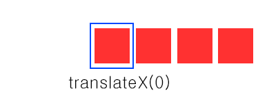
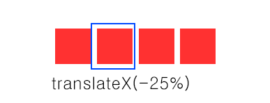
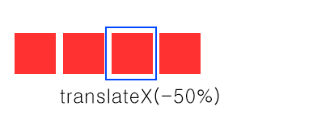
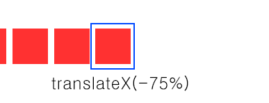

# Carousel UI
  - Carousel UI가 어떻게 동작하는가?

    이미지 네개가 있을 때의 Carousel UI의 예를 보겠다.

    

    

    

    

    파란색 테두리만 있는 것이 실제로 보이는 영역이고 빨간색 박스들은 이미지들이다. 이미지들은 리스트형태로 정렬되어있다.

    파란색 테두리는 `overflow:hidden`을 사용하여 나타낼 수 있다.
    그리고 이미지들의 리스트가 `transform:translateX()`로 인하여 움직이게 되면서 이미지들이 차례대로 보여질 수 있게된다.
     웬만한 Carousel UI 라이브러리들은 이러한 원리를 가지고 만들어졌다.

    
  ## tiny-slider.js 을 사용하자
  아직 미완성..